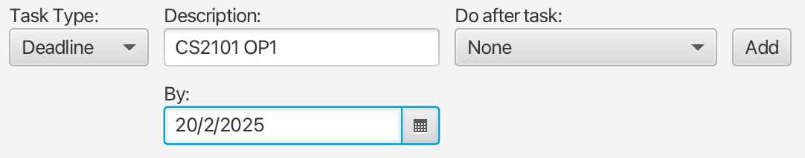

# Olivia User Guide


Welcome to Olivia, your personal todo list app designed to help you manage your tasks efficiently.

# Features

## Adding todo


1. Click and select 'Todo' in the task type dropdown on the left.
2. Key in the description of the todo
3. Click 'Add' on the right.

You will see Todo added to the display panel.

## Adding deadline



1. Click and select 'Deadline' in the task type dropdown on the left.
2. Key in the description of the deadline
3. Click 'Add' on the right.
4. Select the date of the deadline.

You will see Deadline added to the display panel.

## Adding event


1. Click and select 'Event' in the task type dropdown on the left.
2. Key in the description of the event
3. Select the start date and end date of the event.
4. Click 'Add' on the right.

You will see Event added to the display panel.

## Adding do after task


1. During the creation of any task
2. Open the 'Do after task' dropdown
3. Select the previous task that you would like to put this new task after.
4. Click 'Add' on the right

You will see the new task added to the display panel, labelled with "(after: \<previous_task\>)"

## Mark task as done/undone


1. Select the task that you want to mark as done on the display panel.
2. Click 'Mark Done'

You will see the selected task highlighted as green.

Task labelled with \[O\] are completed tasks, \[X\] are pending tasks

## Delete task

1. Select the task that you want to mark as done on the display panel.
2. Click 'Delete'

You will see the selected task removed from the display panel.

## Exit the program

Click 'Bye'

## Saving tasks

Olivia data are saved in the hard disk automatically after any command that changes the data. There is no need to save manually.

You can find the data under `./data` folder, where `olivia.jar` is placed.

```
Caution: If your changes to the data file makes its format invalid, Olivia will discard all data and start with an empty data file at the next run. Hence, it is recommended to take a backup of the file before editing it.

Furthermore, certain edits can cause the Olivia to behave in unexpected ways (e.g., if a value entered is outside of the acceptable range). Therefore, edit the data file only if you are confident that you can update it correctly.
```
